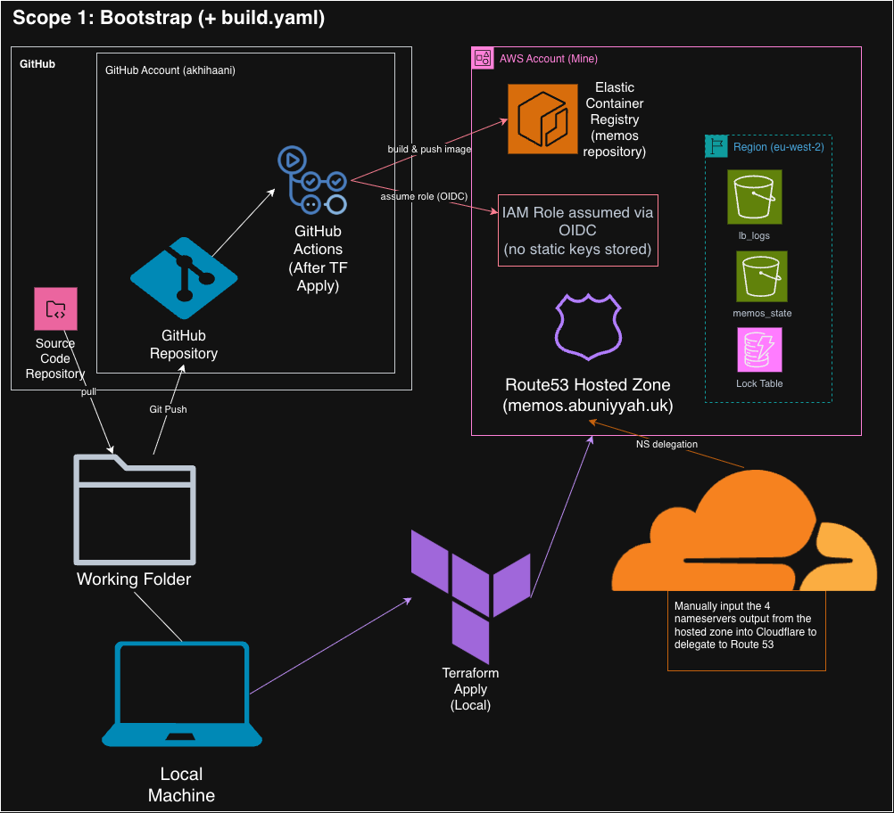
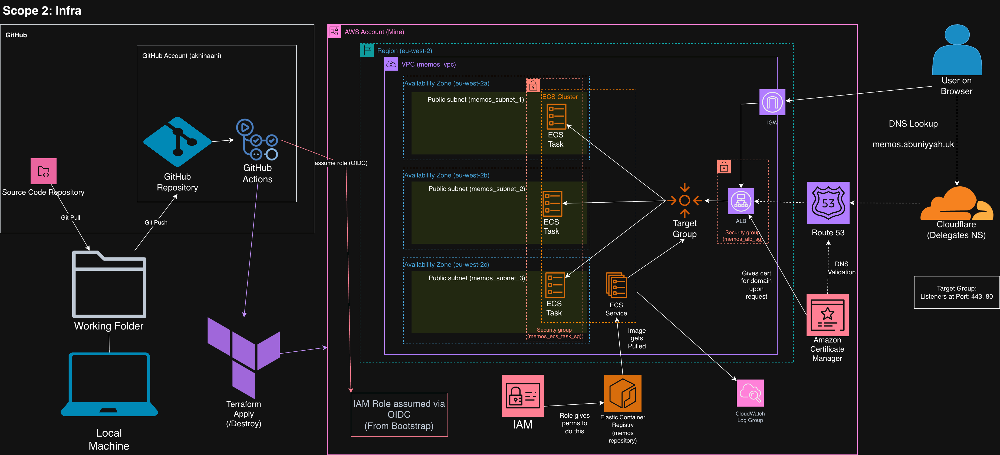

# Table of Contents
- [Project Overview](#project-overview)
  - [Repository structure](#repository-structure)
- [Architecture Diagram](#architecture-diagram)
- [Reproduction Instructions](#reproduction-instructions)
  - [Cloud Set-Up](#cloud-set-up)
  - [Local Set-Up](#local-set-up)
- [Screenshots](#screenshots)
- [Security](#security)
- [Challenges](#challenges)

# Project Overview
This project takes an app called memos and hosts it on Amazon ECS which can be reached publicly on the internet through HTTPS
The project is split into two scopes: Bootstrap and Infra

It demonstrates a production-style, fully IaC + CI/CD Deployment

**Bootstrap (+build.yaml)**:

Applied locally:
- Creates an s3 bucket and dynamodb lock table which are both used for handling terraform state
- State is migrated to remote during bootstrap process
- An IAM role is created for GitHub Actions to use for OIDC (avoids static AWS keys)
- Another S3 bucket is created for collecting logs for the ALB
- The ECR Repository
- The Route 53 hosted zone

CI/CD:
- A docker image of the app is created and pushed to Amazon ECR using a GitHub actions workflow (upon pushing to github)
- Made from multi-stage dockerfile

**Infra**:
- Using a manual GitHub actions workflow, we create infrastructure using terraform onto AWS
- The terraform infrastructure is split across modules to handle everything separately
- This includes creating a network for this application
- The app is hosted on ECS Fargate Tasks within the network
- An ALB is used to route incoming traffic to the ECS tasks
- And Amazon cert manager is used to secure the domain for HTTPS
- and a subdomain is delegated to route 53 from cloudflare and used for the ECS task

**Portability**:
- For anyone forking my repository to have an easier time porting to their values
- I made a BASH script that takes 4 values needed for the project and places them in all the files that need them
- It also sets those values as GitHub actions variables for the workflows
- That includes: AWS Account ID, AWS Region, Github Repo name, Domain
- Easily reproducible, provided the user has an AWS account, GitHub Account, and domain

**Stack**:
- Multi-Stage Dockerfile
- Terraform Modules + Remote State
- ECS Fargate
- ALB
- ACM
- Route 53
- Github Actions w/OIDC

## Repository structure
```
.
├─ dockerfile                          # multi-stage build for the memos image
├─ .dockerignore
├─ .gitignore
├─ .gitmodules                         # pins the memos submodule
├─ setup.sh                            # one-command port: rewrites the 4 values + sets GitHub Actions vars via gh
├─ memos/                              # app source (git submodule → usememos/memos)
├─ bootstrap/                          # Scope 1 — applied LOCALLY (foundational state)
│  ├─ main.tf                          # state bucket, lock table, logs bucket, R53 zone, ECR, OIDC + IAM role
│  ├─ provider.tf
│  ├─ variables.tf
│  ├─ locals.tf
│  ├─ outputs.tf                       # consumed by infra via terraform_remote_state
│  ├─ terraform.tfvars                 # the 4 portable values (account, region, domain, repo)
│  ├─ backend.tf.disabled              # S3 backend; renamed to backend.tf after first apply, then state is migrated
│  └─ github-tight-policy.json.tftpl   # least-privilege IAM policy, rendered via templatefile()
├─ infra/                              # Scope 2 — applied by CI (app infrastructure)
│  ├─ backend.tf                       # S3 backend + reads bootstrap remote state
│  ├─ main.tf                          # wires the modules together
│  ├─ provider.tf / variables.tf / locals.tf / outputs.tf
│  ├─ terraform.tfvars
│  └─ modules/
│     ├─ vpc/                          # VPC, public subnets, ALB SG + ECS task SG
│     ├─ alb/                          # ALB, listeners (80→443), target group
│     ├─ acm/                          # certificate + DNS validation records
│     └─ ecs/                          # cluster, service, task def + task-definition.json (envsubst'd in deploy.yaml)
├─ .github/workflows/
│  ├─ build.yaml                       # build & push image to ECR (push/PR/dispatch)
│  ├─ deploy.yaml                      # tf fmt/validate/tflint/apply → render task def → deploy to ECS → healthcheck (dispatch)
│  └─ destroy.yaml                     # terraform destroy (dispatch)
├─ documents/                          # architecture diagrams + deployment screenshots
└─ README.md
```

# Architecture Diagram

## Scope 1 — Bootstrap


## Scope 2 — Infrastructure



# Reproduction Instructions

## Cloud Set-Up
**Pre-Requisites**:
First you need to have an AWS account and you need to configure it to your local Command Line Interface.

CLI configuration:
First download the AWS CLI if you do not already have it
Then:
```
aws configure
```

You will need an IAM User to connect to the CLI
In the AWS Console, go to IAM > Users > Create User
Give the User whatever permissions you wish
Once the user is created select it and go to the 'Security Credentials Tab'
Scroll down to Access Keys and create one, this gives you the values you need for CLI connection

Follow the prompts and enter the following details:
- 1. AWS Access Key ID: Paste the Access Key associated with your IAM user 
- 2. AWS Secret Access Key: Paste the Secret Key associated with your IAM user
- 3. Default Region Name: e.g. 'eu-west-2'
- 4. Default Output Format: JSON

Domain:
You also need to own a domain
Go to any domain registrar, such as cloudflare, and purchase a domain.

GitHub Repository:
Create a fork of the GitHub repository
Use the 'Fork' button on the top right of the repository page

Then pull the repo to your local machine with:
```
git clone --recurse-submodules <your-fork-url>
cd <your-fork>
```

```
gh auth login
```
(install 'gh' with your package manager if you do not already have it)

```
./setup.sh
```
(This will make the project hold your specific variables)

**Bootstrap**:
Use:
```
cd bootstrap
terraform init
terraform apply -auto-approve
mv backend.tf.disabled backend.tf
terraform init -migrate-state -force-copy
terraform apply -auto-approve
```

**Manual**:
- From the output of the bootstrap terraform apply, 4 nameservers are outputted
- Those must be pasted as NS records into the domain registrar of the domain (or subdomain) you own
- This delegates authority over it to route 53

**GitHub Actions**:
There are three workflows that can be used:
- build.yaml: Will create a docker image and push it to Amazon ECR. Is activated manually in the GitHub Actions Tab or by pushing to GitHub
- deploy.yaml: Will terraform apply 'Infra'. Is activated manually in the GitHub Actions Tab
- destroy.yaml: Will terraform destroy 'Infra'. Is activated manually in the GitHub Actions Tab

Because you forked the repository you need to enable workflows in the GitHub Actions Tab
[Open your repository's Actions tab](../../actions)

Notes:
- build.yaml must be run and completed before using deploy.yaml
- Certificate validation in deploy.yaml can take 10-15 minutes, so you will need to wait

**Terminal commands**:
Use:
```
gh repo set-default <your-fork>
```

You can use the following commands to run the workflows from the terminal:
```
gh workflow run build.yaml
```

```
gh workflow run deploy.yaml
```

```
gh workflow run destroy.yaml
```

You can also monitor your workflows from the terminal using:
```
gh run list
  # See recent runs + their status

gh run watch
  # live-follow the latest run until it finishes

gh run view --log
  # Full logs of a run
```

**Verify**:
```
Visit [https://<domain-name>] and check if it is working
[https://<domain-name>/healthz] can be used for health status checking
```

## Local Set-Up
Open docker engine

Run in terminal:
```
docker build -t memos -f dockerfile ./memos
docker run --rm --name memos -p 8081:8081 -v ~/.memos:/var/opt/memos memos
```

Visit 'http://localhost:8081' to use your container
Healthcheck: 'http://localhost:8081/healthz'

# Screenshots

## Live Application (HTTPS)


## CI/CD Pipelines


## AWS Infrastructure


## Local Container


# Security

- OIDC, no static keys in CI; trust scoped to the main branch
- Least-privilege IAM (tight policy, not AdministratorAccess)
- Non-root container + minimal binary permissions
- Security groups as explicit boundaries (ALB SG → task SG only)
- Encrypted remote state + S3 public access blocked + state locking
- HTTPS via ACM with HTTP > HTTPS redirect

# Challenges
- /health endpoint was not working, after doing some digging in the app code, I found /healthz as the real endpoint
  This was because the /health endpoint was gRPC instead of HTTP

- Shrinked the image size down from 234mb to 88mb.
  What was going wrong was that the next layer would copy from the previous, doubling the size
  I also adjusted the dockerfile to include CGO_ENABLED=0 so that it can run on alpine since the container wasn't running
  and added [-ldflags="-s -w"] which stripped the symbol table that debuggers use, shrinking the image further

- I had a typo in my dockerfile between -o/-O in my healthcheck and this caused an 'unhealthy targets' error that I spent hours on

- When creating the CI/CD workflows I realised that bootstrap state needed to be migrated remotely for it to work
  since the VM running the workflows did not have access to my bootstrap
  So I added an S3 backend to bootstrap and migrated state remotely then pointed infra's remote_state at S3 instead of local

- Made a custom IAM policy for the GitHub actions account
  first used adminAccess to test the workflows and used CloudTrail to see which permissions were needed
  I generated a policy from cloudtrail and then scoped it down to specific ARNs